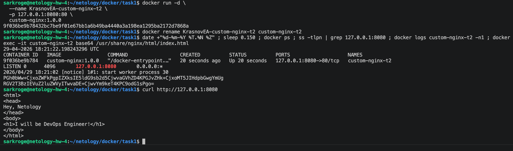
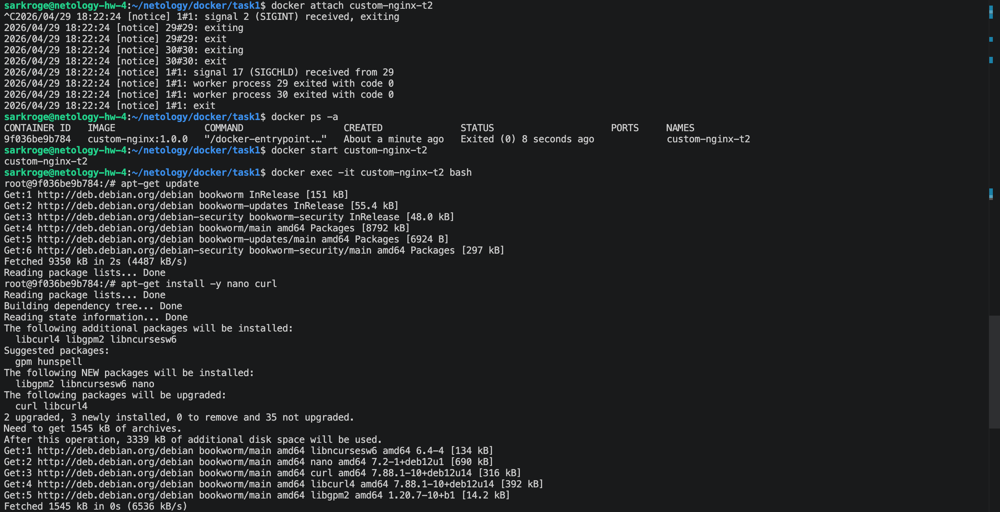
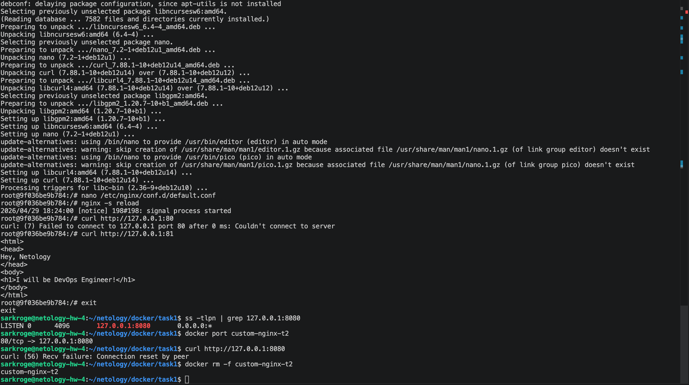
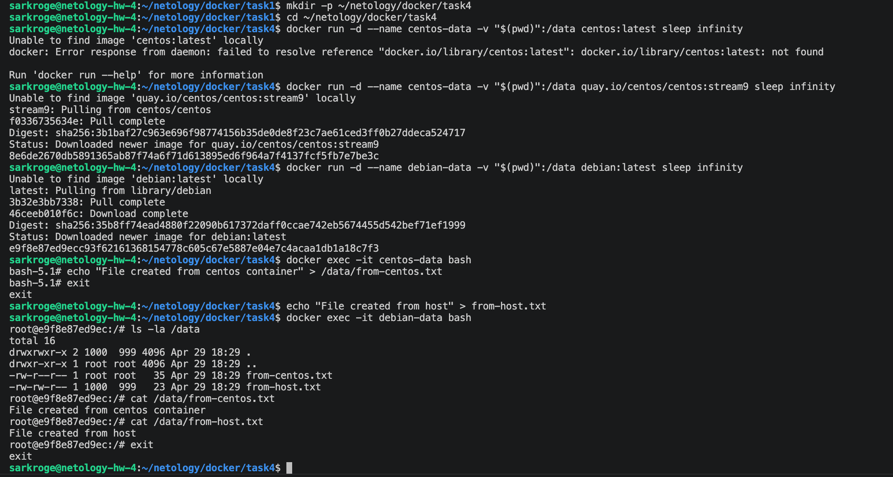
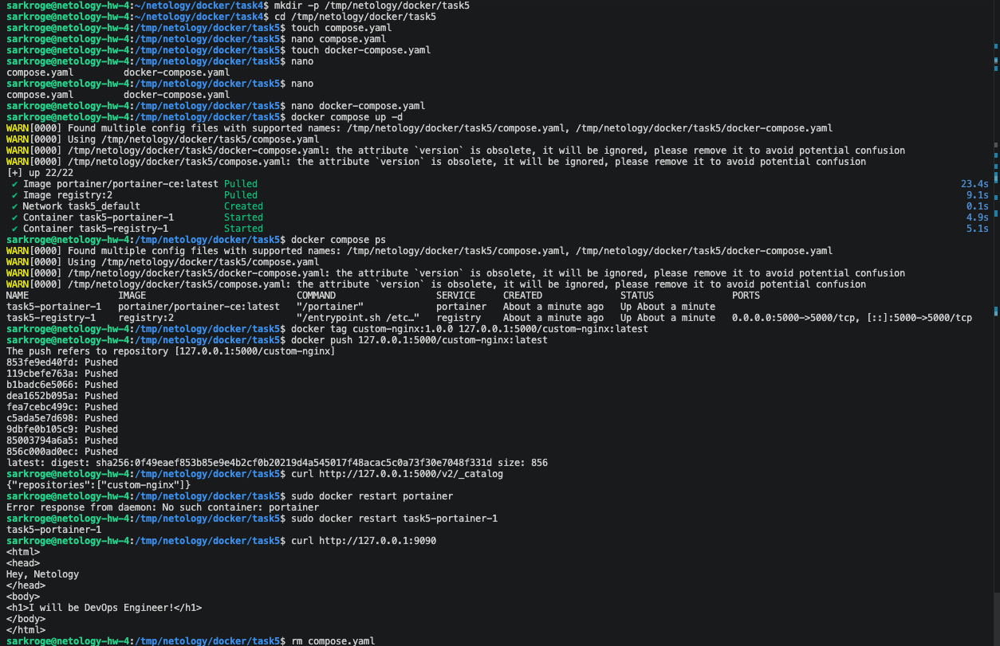
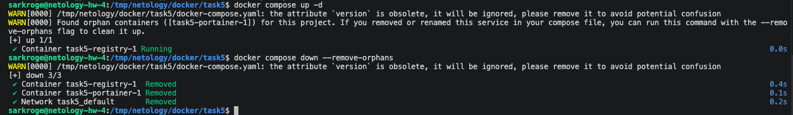
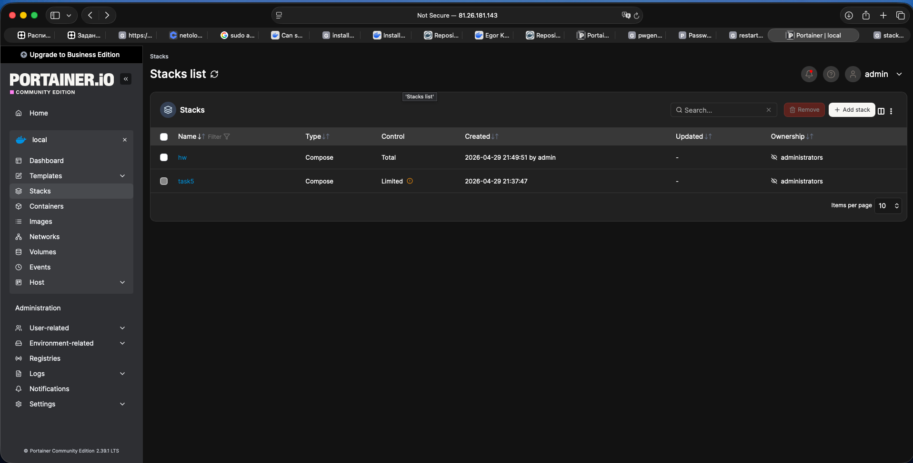
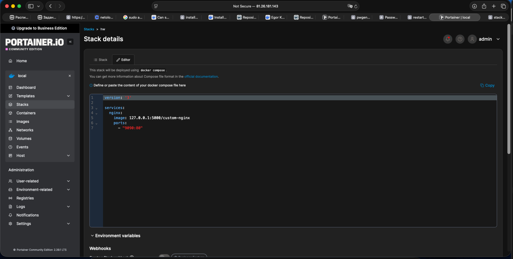
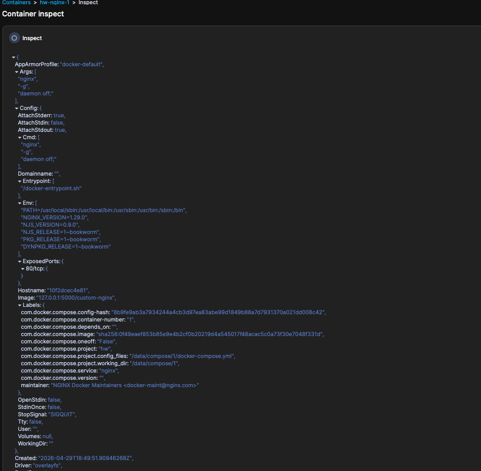

# Домашнее задание к занятию 4
## Оркестрация группой Docker контейнеров на примере Docker Compose

> Студент: **Krasnov EA**  
> Репозиторий: `https://github.com/sarkroge/hw4#`

---

## Задача 1

### Установка Docker и Docker Compose plugin

Docker и Docker Compose plugin были установлены на Linux ВМ.

Команды установки:

```bash
sudo apt update
sudo apt install ca-certificates curl
sudo install -m 0755 -d /etc/apt/keyrings
sudo curl -fsSL https://download.docker.com/linux/ubuntu/gpg -o /etc/apt/keyrings/docker.asc
sudo chmod a+r /etc/apt/keyrings/docker.asc

sudo tee /etc/apt/sources.list.d/docker.sources <<EOF
Types: deb
URIs: https://download.docker.com/linux/ubuntu
Suites: $(. /etc/os-release && echo "${UBUNTU_CODENAME:-$VERSION_CODENAME}")
Components: stable
Architectures: $(dpkg --print-architecture)
Signed-By: /etc/apt/keyrings/docker.asc
EOF

sudo apt update

sudo apt install docker-ce docker-ce-cli containerd.io docker-buildx-plugin docker-compose-plugin
```

### Создание собственного образа nginx

Создана рабочая директория:

```bash
mkdir -p ~/netology/docker/task1
cd ~/netology/docker/task1
```

Создан файл `index.html`:

```html
<html>
<head>
Hey, Netology
</head>
<body>
<h1>I will be DevOps Engineer!</h1>
</body>
</html>
```

Создан файл `Dockerfile`:

```Dockerfile
FROM nginx:1.29.0
COPY index.html /usr/share/nginx/html/index.html
```

Скачан исходный образ nginx:

```bash
docker pull nginx:1.29.0
```

Собран собственный образ:

```bash
docker build -t custom-nginx:1.0.0 .
```

Проверка наличия образа:

```bash
docker images | grep custom-nginx
```

Образ был отправлен в публичный репозиторий:

```bash
docker login
docker tag custom-nginx:1.0.0 sarkroge/custom-nginx:1.0.0
docker push sarkroge/custom-nginx:1.0.0
```

Ссылка на Docker Hub:

```text
https://hub.docker.com/repository/docker/sarkroge/custom-nginx/general
```

## Задача 2

Контейнер был запущен из образа `custom-nginx:1.0.0` в фоновом режиме с публикацией порта на `127.0.0.1:8080`.

```bash
docker run -d \
  --name KrasnovEA-custom-nginx-t2 \
  -p 127.0.0.1:8080:80 \
  custom-nginx:1.0.0
```

Контейнер был переименован:

```bash
docker rename KrasnovEA-custom-nginx-t2 custom-nginx-t2
```

Выполнена проверочная команда:

```bash
date +"%d-%m-%Y %T.%N %Z" ; sleep 0.150 ; docker ps ; ss -tlpn | grep 127.0.0.1:8080 ; docker logs custom-nginx-t2 -n1 ; docker exec -it custom-nginx-t2 base64 /usr/share/nginx/html/index.html
```

Проверена доступность индексной страницы:

```bash
curl http://127.0.0.1:8080
```

Индексная страница успешно отдается контейнером nginx.

### Скриншоты



---

## Задача 3

Для подключения к стандартным потокам ввода, вывода и ошибок контейнера использовалась команда `docker attach`:

```bash
docker attach custom-nginx-t2
```

После подключения была нажата комбинация `Ctrl-C`.

Проверка состояния контейнера:

```bash
docker ps -a
```

Контейнер оказался остановлен.

### Почему контейнер остановился

Команда `docker attach` подключает текущий терминал к основному процессу контейнера. При нажатии `Ctrl-C` сигнал завершения был передан основному процессу nginx. Так как основной процесс контейнера завершился, сам контейнер тоже остановился.

Чтобы отсоединиться от контейнера без остановки, обычно используется комбинация:

```text
Ctrl-P, затем Ctrl-Q
```

### Перезапуск контейнера

```bash
docker start custom-nginx-t2
```

Вход в интерактивный терминал контейнера:

```bash
docker exec -it custom-nginx-t2 bash
```

Внутри контейнера был установлен текстовый редактор и curl:

```bash
apt-get update
apt-get install -y nano curl
```

Файл конфигурации nginx был открыт на редактирование:

```bash
nano /etc/nginx/conf.d/default.conf
```

В конфигурации порт был изменён:

```nginx
listen 80;
```

на:

```nginx
listen 81;
```

После изменения конфигурации была выполнена перезагрузка nginx:

```bash
nginx -s reload
```

Проверка внутри контейнера:

```bash
curl http://127.0.0.1:80
curl http://127.0.0.1:81
```

Выход из контейнера:

```bash
exit
```

Проверка на хосте:

```bash
ss -tlpn | grep 127.0.0.1:8080
docker port custom-nginx-t2
curl http://127.0.0.1:8080
```

### Суть возникшей проблемы

При запуске контейнера Docker пробросил порт хоста `127.0.0.1:8080` на порт `80` внутри контейнера.

После изменения конфигурации nginx стал слушать порт `81` внутри контейнера, но Docker-проброс остался прежним: `8080` на хосте всё ещё ведёт на `80` порт контейнера.

Из-за этого nginx внутри контейнера работает на `81`, но снаружи через `127.0.0.1:8080` страница становится недоступна.

Контейнер был удалён без предварительной остановки:

```bash
docker rm -f custom-nginx-t2
```

### Скриншоты





---

## Задача 4

Создана рабочая директория:

```bash
mkdir -p ~/netology/docker/task4
cd ~/netology/docker/task4
```

Запущен первый контейнер из образа CentOS с подключением текущей директории хоста в `/data` контейнера:

```bash
docker run -d --name centos-data -v "$(pwd)":/data quay.io/centos/centos:stream9 sleep infinity
```

Запущен второй контейнер из образа Debian с подключением текущей директории хоста в `/data` контейнера:

```bash
docker run -d --name debian-data -v "$(pwd)":/data debian:latest sleep infinity
```

Подключение к первому контейнеру:

```bash
docker exec -it centos-data bash
```

Создание файла внутри контейнера CentOS:

```bash
echo "File created from centos container" > /data/from-centos.txt
exit
```

Создание файла на хостовой машине:

```bash
echo "File created from host" > from-host.txt
```

Подключение ко второму контейнеру Debian:

```bash
docker exec -it debian-data bash
```

Проверка файлов:

```bash
ls -la /data
cat /data/from-centos.txt
cat /data/from-host.txt
exit
```

### Вывод

Оба контейнера используют один и тот же каталог хостовой системы, примонтированный в `/data`. Поэтому файл, созданный в контейнере CentOS, и файл, созданный на хосте, доступны внутри контейнера Debian.

### Скриншот



---

## Задача 5

Создана отдельная директория:

```bash
mkdir -p /tmp/netology/docker/task5
cd /tmp/netology/docker/task5
```

Создан файл `compose.yaml`:

```yaml
version: "3"
services:
  portainer:
    network_mode: host
    image: portainer/portainer-ce:latest
    volumes:
      - /var/run/docker.sock:/var/run/docker.sock
```

Создан файл `docker-compose.yaml`:

```yaml
version: "3"
services:
  registry:
    image: registry:2

    ports:
    - "5000:5000"
```

Выполнена команда:

```bash
docker compose up -d
```

### Какой файл был запущен и почему

По умолчанию Docker Compose использовал файл `compose.yaml`.

`compose.yaml` является современным стандартным именем compose-файла. Поэтому при выполнении команды `docker compose up -d` без явного указания файла Docker Compose выбрал именно его.

### Запуск обоих compose-файлов

Файл `compose.yaml` был отредактирован так, чтобы подключать второй compose-файл через директиву `include`:

```yaml
version: "3"

include:
  - docker-compose.yaml

services:
  portainer:
    network_mode: host
    image: portainer/portainer-ce:latest
    volumes:
      - /var/run/docker.sock:/var/run/docker.sock
```

После этого были запущены оба сервиса:

```bash
docker compose up -d
docker compose ps
```

### Загрузка образа custom-nginx в локальный registry

Образ `custom-nginx:1.0.0` был переименован для локального registry:

```bash
docker tag custom-nginx:1.0.0 127.0.0.1:5000/custom-nginx:latest
```

Образ был отправлен в локальный registry:

```bash
docker push 127.0.0.1:5000/custom-nginx:latest
```

Проверка содержимого registry:

```bash
curl http://127.0.0.1:5000/v2/_catalog
```

### Настройка Portainer

В браузере была открыта страница:

```text
http://127.0.0.1:9000
```

Была выполнена первичная настройка Portainer: создан пользователь администратора.

После этого было выбрано локальное окружение Docker.

### Деплой stack в Portainer

В разделе `Stacks` через `Web editor` был задеплоен compose-файл:

```yaml
version: '3'

services:
  nginx:
    image: 127.0.0.1:5000/custom-nginx
    ports:
      - "9090:80"
```

Проверка доступности nginx:

```bash
curl http://127.0.0.1:9090
```

В Portainer был открыт контейнер nginx, нажата кнопка `Inspect`, в режиме Tree раскрыто поле `Config`. Сделан скриншот от поля `AppArmorProfile` до `Driver`.

### Проверка предупреждения orphan containers

Один из compose-манифестов был удалён:

```bash
rm compose.yaml
```

После этого была выполнена команда:

```bash
docker compose up -d
```

Docker Compose вывел предупреждение об orphan containers.

### Суть предупреждения

Orphan containers — это контейнеры, которые были созданы предыдущей конфигурацией compose-проекта, но отсутствуют в текущем compose-файле.

Так как один из compose-файлов был удалён, Docker Compose больше не видит часть сервисов в актуальной конфигурации и предупреждает, что ранее созданные контейнеры теперь являются «осиротевшими».

Для удаления таких контейнеров используется ключ `--remove-orphans`.

Compose-проект был остановлен одной командой:

```bash
docker compose down --remove-orphans
```

### Скриншоты











---

## Итог

В ходе выполнения домашнего задания были выполнены следующие действия:

- установлен Docker и Docker Compose plugin;
- создан собственный Docker-образ на базе nginx;
- запущен контейнер с публикацией порта на localhost;
- проверена работа `docker attach`, `docker exec`, `docker logs`, `docker port`;
- изучена проблема несоответствия внутреннего порта приложения и проброшенного Docker-порта;
- проверена работа bind mount между двумя контейнерами и хостовой системой;
- запущены Portainer и локальный Docker Registry через Docker Compose;
- образ `custom-nginx` загружен в локальный registry;
- через Portainer задеплоен stack с nginx;
- изучено предупреждение Docker Compose об orphan containers.
